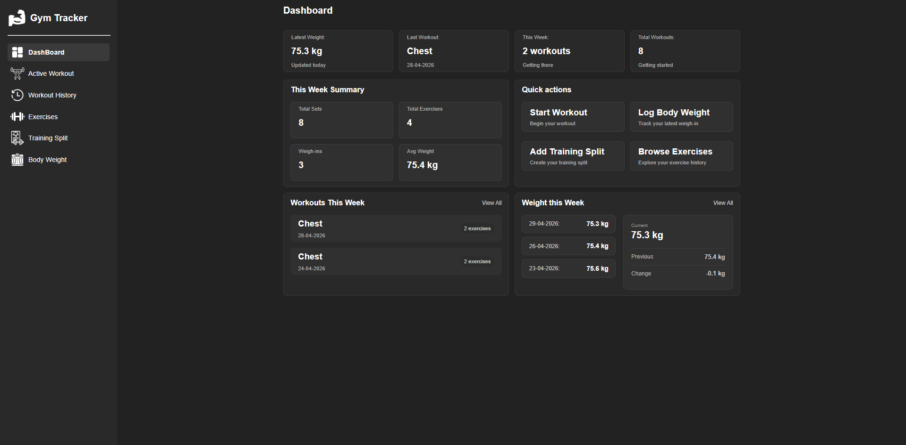
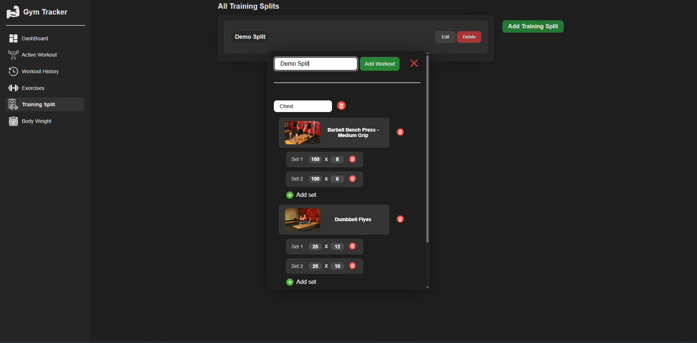
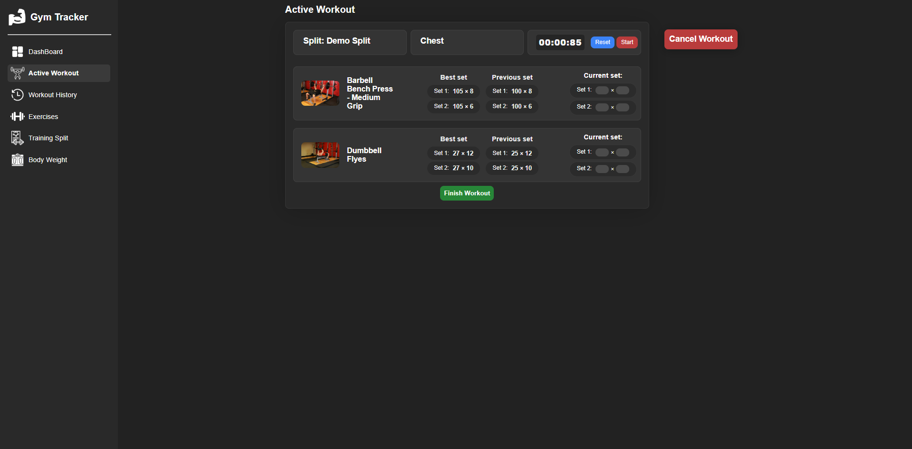
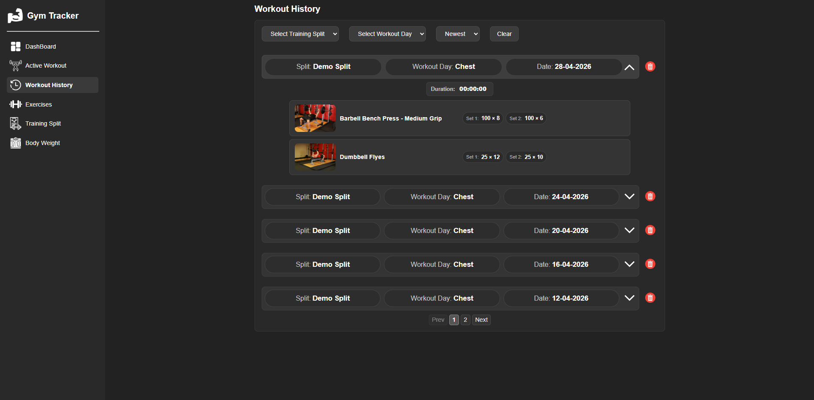
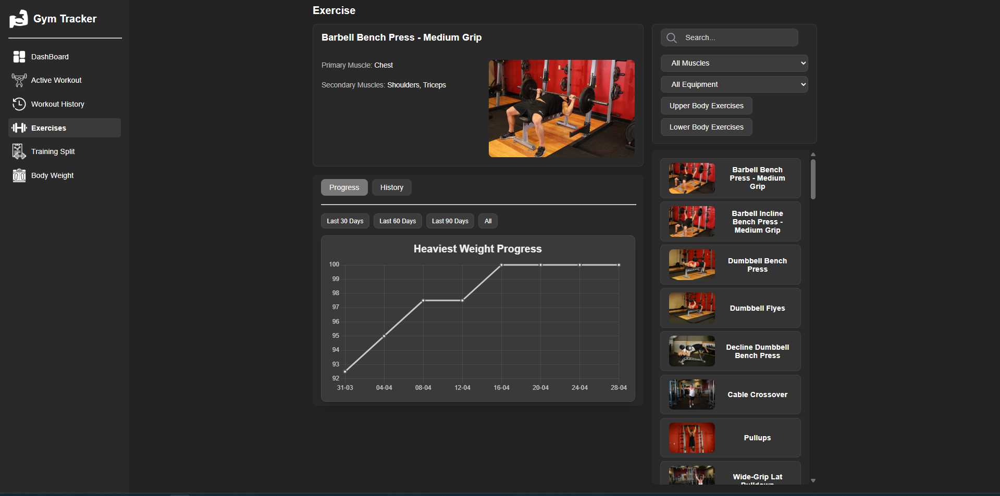
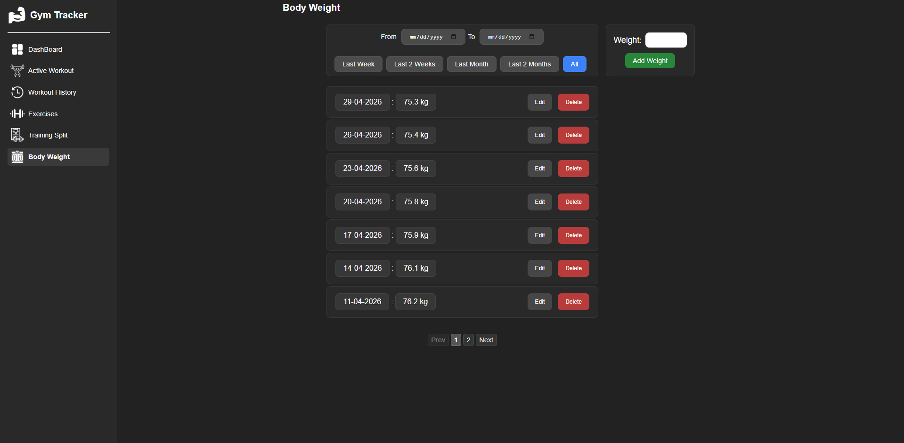

# Gym Tracker

Gym Tracker is a React and TypeScript fitness tracking app built around the full workout flow: creating training splits, running active workout sessions, saving completed workouts, and reviewing progress over time.

The app allows users to build their own training split, add workout days and exercises, record sets during an active workout, and save completed sessions to workout history. It also includes body weight tracking, exercise progress charts, dashboard summaries, and exercise filtering by muscle group and equipment.

Supabase is used for storing training splits, workout history, and body weight entries.

## Live Demo

[Live Demo](https://gym-tracker-azure-tau.vercel.app/)

The deployed version includes shared sample data so the main features can be previewed immediately.

## Screenshots

### Dashboard


### Training split



### Active Workout


### Workout History


### Exercises


### Body Weight



## Features

- Create and manage custom training splits
- Add workout days, exercises, and sets
- Start an active workout from a selected training split
- Track workout duration with a built-in timer
- Save completed workouts to workout history
- Review past workouts and training details
- Browse exercises by muscle group and equipment
- View exercise progress with charts
- Track body weight over time
- Filter body weight entries by date range
- View dashboard summaries for recent workouts, sets, exercises, and body weight activity
- Responsive layout for desktop and mobile screens
- Store app data with Supabase

## Tech Stack

### Frontend

- React
- TypeScript
- Vite
- React Router
- CSS Modules
- Chart.js

### Data Storage

- Supabase

## Installation

1. Clone the repository

```bash
git clone https://github.com/Luan2118/gym-tracker.git
cd gym-tracker-project
```

2. Install dependencies

```bash
npm install
```

3. Create a `.env` file in the project root and add your Supabase credentials

```env
VITE_SUPABASE_URL=your_supabase_project_url
VITE_SUPABASE_PUBLISHABLE_KEY=your_supabase_publishable_key
```

4. Start the development server

```bash
npm run dev
```

## Environment Variables

This project uses Supabase for data storage. To run the project locally, you need a Supabase project with matching database tables and the following environment variables:

```env
VITE_SUPABASE_URL=
VITE_SUPABASE_PUBLISHABLE_KEY=
```

An empty `.env.example` file is included in the repository as a template. The real `.env` file is not included in the repository.

## Project Structure

```txt
src/
├── api/              # Supabase API functions
├── assets/           # Static assets used by the app
├── components/       # Shared UI components
├── data/             # Local exercise data
├── layout/           # Main layout and shared app state
├── lib/              # Supabase client configuration
├── pages/            # App pages/routes
├── utils/            # Reusable helper functions
└── types.ts          # Shared TypeScript types
```

## Current Limitations

- The app does not include user authentication
- The deployed demo uses shared sample data
- Exercise data is based on a curated local exercise list
- The app is focused on individual workout tracking, not coaching or social features
- Local setup requires a Supabase project with matching database tables

## Future Improvements

- Add user authentication
- Add custom exercises
- Add more advanced workout statistics
- Improve exercise progress analytics
- Add automated tests